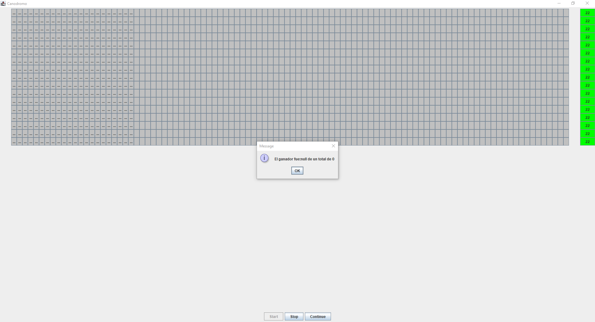

### Escuela Colombiana de Ingeniería

### Arquitecturas de Software – ARSW
## Laboratorio Programación concurrente, condiciones de carrera, esquemas de sincronización, colecciones sincronizadas y concurrentes - Caso Dogs Race

### Descripción:
Este ejercicio tiene como fin que el estudiante conozca y aplique conceptos propios de la programación concurrente.

### Parte I 
Antes de terminar la clase.

Creación, puesta en marcha y coordinación de hilos.

1. Revise el programa “primos concurrentes” (en la carpeta parte1), dispuesto en el paquete edu.eci.arsw.primefinder. Este es un programa que calcula los números primos entre dos intervalos, distribuyendo la búsqueda de los mismos entre hilos independientes. Por ahora, tiene un único hilo de ejecución que busca los primos entre 0 y 30.000.000. Ejecútelo, abra el administrador de procesos del sistema operativo, y verifique cuantos núcleos son usados por el mismo.

**Luego de Ejecutar la clase ```Main``` del programa, al abrir Java VisualVM, podemos observar que el consumo de recursos es muy alto, como se ve en la gráfica ```CPU usage``` de la siguiente imagen, al principio el programa consumió mucho porcentaje (casi del 50%) de la CPU, dando como resultado un consumo muy alto de recursos. Asimismo, se observa también en la gráfica de ```Threads``` que el programa fue ejecutado con 1 solo hilo.**


**Luego de abrir el Administrador de Procesos del sistema operativo, se demuestra que el consumo de CPU fue considerablemente alto, consumiendo los 4 núcleos del computador que se dispuso para realizar el experimento, como se puede ver a continuación.**


2. Modifique el programa para que, en lugar de resolver el problema con un solo hilo, lo haga con tres, donde cada uno de éstos hará la tarcera parte del problema original. Verifique nuevamente el funcionamiento, y nuevamente revise el uso de los núcleos del equipo.

**Primero, modificamos el programa de la siguiente forma, implementando dos hilos demás, y cambiando el rango de los mismos, siendo ahora, el primer hilo ```pft1``` que encuentra los números primos desde el número 0 al número 10000000, el segundo hilo ```pft2``` que encuentra los números primos desde el número 10000000 al número 20000000 y el tercer hilo ```pft3``` que encuentra los números primos desde el número 20000000 al número 30000000, quedando la clase ```Main``` de la siguiente forma.**

```java
public class Main {
	public static void main(String[] args) {
		PrimeFinderThread pft1=new PrimeFinderThread(0, 10000000);
		PrimeFinderThread pft2=new PrimeFinderThread(10000000, 20000000);
		PrimeFinderThread pft3=new PrimeFinderThread(20000000, 30000000);
		pft1.start();
		pft2.start();
		pft3.start();
	}
}
```

**Luego de abrir nuevamente Java VisualVM, se evidencia un menor consumo de recursos, principalmente de CPU, ya que como se puede ver en la gráfica ```CPU usage```, consume un máximo de 30% de porcentaje de CPU al ejecutar el programa, representando así un mejor rendimiento ya que el programa encuentra los números primos en un menor tiempo. También en la gráfica ```Threads```, se evidencia el consumo de los 3 hilos implementados en el código mostrado con anterioridad, demostrando el funcionamiento correcto del código en cuanto al número de hilos y el porcentaje de CPU consumido comparado con el punto anterior.**


3. Lo que se le ha pedido es: debe modificar la aplicación de manera que cuando hayan transcurrido 5 segundos desde que se inició la ejecución, se detengan todos los hilos y se muestre el número de primos encontrados hasta el momento. Luego, se debe esperar a que el usuario presione ENTER para reanudar la ejecución de los mismo.

**Para realizar esta parte, primero se importaron las librerías ```java.io.*``` y ```java.util.*```, para poder implementar ```resume()``` y ```suspend()```, los cuales serán ejecutados dentro de un Timer de 5 segundos (5000 milisegundos), para luego detener todos los hilos con el ```suspend()```, y reanudarlos luego de realizar la lectura del salto de línea registrado por el teclado luego de presionar ENTER, usando ```BufferedReader```, para así reanudar todos los hilos y seguir con la ejecución del programa. El código de esta parte quedó de la siguiente forma.**

```java
public class Main {
	public static void main(String[] args) {
		PrimeFinderThread pft1=new PrimeFinderThread(0, 10000000);
		PrimeFinderThread pft2=new PrimeFinderThread(10000000, 20000000);
		PrimeFinderThread pft3=new PrimeFinderThread(20000000, 30000000);
		pft1.start();
		pft2.start();
		pft3.start();
		BufferedReader br = new BufferedReader(new InputStreamReader(System.in));
		new Timer().schedule( 
		        new TimerTask() {
		            @Override
		            public void run() {
		                try {
		                	pft1.suspend();
							pft2.suspend();
							pft3.suspend();
							while(br.read() != '\n') {
								br.read();
							}
							pft1.resume();
							pft2.resume();
							pft3.resume();
						} catch (IOException e) {
							e.printStackTrace();
						}
		            }
		        },5000);
	}
}
```

### Parte II 


Para este ejercicio se va a trabajar con un simulador de carreras de galgos (carpeta parte2), cuya representación gráfica corresponde a la siguiente figura:


En la simulación, todos los galgos tienen la misma velocidad (a nivel de programación), por lo que el galgo ganador será aquel que (por cuestiones del azar) haya sido más beneficiado por el *scheduling* del
procesador (es decir, al que más ciclos de CPU se le haya otorgado durante la carrera). El modelo de la aplicación es el siguiente:


Como se observa, los galgos son objetos ‘hilo’ (Thread), y el avance de los mismos es visualizado en la clase Canodromo, que es básicamente un formulario Swing. Todos los galgos (por defecto son 17 galgos corriendo en una pista de 100 metros) comparten el acceso a un objeto de tipo
RegistroLLegada. Cuando un galgo llega a la meta, accede al contador ubicado en dicho objeto (cuyo valor inicial es 1), y toma dicho valor como su posición de llegada, y luego lo incrementa en 1. El galgo que
logre tomar el ‘1’ será el ganador.

Al iniciar la aplicación, hay un primer error evidente: los resultados (total recorrido y número del galgo ganador) son mostrados antes de que finalice la carrera como tal. Sin embargo, es posible que una vez corregido esto, haya más inconsistencias causadas por la presencia de condiciones de carrera.

En la siguente imagen visualizamos que el problema del mensaje esta solucionado, para ello modificacmos la clase MainCanodromo.
	

 
Parte III

1.  Corrija la aplicación para que el aviso de resultados se muestre
    sólo cuando la ejecución de todos los hilos ‘galgo’ haya finalizado.
    Para esto tenga en cuenta:

    a.  La acción de iniciar la carrera y mostrar los resultados se realiza a partir de la línea 38 de MainCanodromo.

    b.  Puede utilizarse el método join() de la clase Thread para sincronizar el hilo que inicia la carrera, con la finalización de los hilos de los galgos.
    
**Para corregir la aplicación, para que el aviso de resultados muestre sólo cuando la ejecución de todos los hilos ‘galgo’ haya finalizado, se utilizó método ```join()``` de la clase Thread del método Main, con la cual se sincronizó el hilo que inicia la carrera, con la finalización de los hilos de los galgos, utilizando un booleano encargado de mostrar el aviso de resultados solamente cuando los hilos finalizann, como se muestra en el siguiente código.**

```java
public static void main(String[] args) {
        can = new Canodromo(17, 100);
        galgos = new Galgo[can.getNumCarriles()];
        can.setVisible(true);
        //Acción del botón start
        can.setStartAction(
                new ActionListener() {
                    @Override
                    public void actionPerformed(final ActionEvent e) {
			//como acción, se crea un nuevo hilo que cree los hilos
                        //'galgos', los pone a correr, y luego muestra los resultados.
                        //La acción del botón se realiza en un hilo aparte para evitar
                        //bloquear la interfaz gráfica.
                        ((JButton) e.getSource()).setEnabled(false);
                        new Thread() {
                            public void run() {
                                for (int i = 0; i < can.getNumCarriles(); i++) {
                                    //crea los hilos 'galgos'
                                    galgos[i] = new Galgo(can.getCarril(i), "" + i, reg);
                                    //inicia los hilos
                                    galgos[i].start();
                                }
                                boolean var = true;
                                for (Galgo j : galgos) {
                                	try {
                        			j.join();
                        			if (var) {
                        				can.winnerDialog(reg.getGanador(),reg.getUltimaPosicionAlcanzada() - 1); 
                        				System.out.println("El ganador fue:" + reg.getGanador());
                        				var = false;
                        			}
                        		} catch (InterruptedException e1) {
                        			e1.printStackTrace();
                        	        }
                                }
                            }
                        }.start();
                    }
                }
        );
```

**Para comprobar el funcionamiento correcto del código, se ejecutó desde el ```main``` el código, mostrando primero la carrera, como se ve a continuación.**

Imagen

**Luego de que la carrera ha finalizado, se muestra el respectivo aviso del ganador, como se ve a continuación.**

Imagen

**Finalmente, el programa retorna las posiciones de la carrera en la Consola de Java de la siguiente forma.**

Imagen

2.  Una vez corregido el problema inicial, corra la aplicación varias
    veces, e identifique las inconsistencias en los resultados de las
    mismas viendo el ‘ranking’ mostrado en consola (algunas veces
    podrían salir resultados válidos, pero en otros se pueden presentar
    dichas inconsistencias). A partir de esto, identifique las regiones
    críticas () del programa.

3.  Utilice un mecanismo de sincronización para garantizar que a dichas
    regiones críticas sólo acceda un hilo a la vez. Verifique los
    resultados.

4.  Implemente las funcionalidades de pausa y continuar. Con estas,
    cuando se haga clic en ‘Stop’, todos los hilos de los galgos
    deberían dormirse, y cuando se haga clic en ‘Continue’ los mismos
    deberían despertarse y continuar con la carrera. Diseñe una solución que permita hacer esto utilizando los mecanismos de sincronización con las primitivas de los Locks provistos por el lenguaje (wait y notifyAll).

## Autores
[Alejandro Toro Daza](https://github.com/Skullzo)

[David Fernando Rivera Vargas](https://github.com/DavidRiveraRvD)
## Licencia
Licencia bajo la [GNU General Public License](https://github.com/Skullzo/ARSW-Lab2/blob/main/LICENSE).
